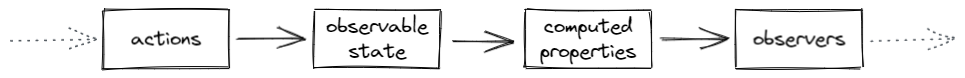

# ReactiveState

Simple reactive state management for Python.

~~~shell
pip install reactivestate
~~~

## Quick example

These are the basic building blocks.
~~~python
from reactivestate import (
    observable, observe, computed, action
)
~~~

First create some observable data. Let's also add a computed property.
~~~python
@observable
class MyState:
    def __init__(self):
        self.counter = 1

    @computed
    def text(self):
        return f"Counter = {self.counter}."

state = MyState()
~~~

Define a function that uses the data and start observing.
~~~python
def print_text():
    print(state.text)

observe(print_text)

[Output] "Counter = 1"
~~~

Calling `observe` will run the given function and then rerun it when any of its dependencies change. Use actions to mutate state. 
~~~python
with action():
    state.counter += 1

[Output] "Counter = 2"
~~~

When an action finishes, the state mutations are propagated throughout affected computeds and observers. Computeds and observers are state derivations. Computeds derive their values from state and other computeds. Observers don't produce values, but side effects instead. They can be used for example to redraw part of a UI. 

These derivations are efficient: If a computed is not observed, or if its dependencies did not produce a new value, recalculation is skipped. Similarly, observers rerun only when their dependencies change. The dependency tree is updated behind the scenes and all reactive calculations run synchronously. 

In summary, actions mutate observable state. Computed properties react automatically to state changes, but only if they have to. Observers rerun when their dependencies change. This allows you to model application state in an efficient and very predictable way.

## API

### action
Mutate observable state.

### observable
Create observable state.

### computed
Computed properties produce values that depend on observable state or other computed properties. It will observe its dependencies and recompute only when needed. 

### observe
Observers produce side effects that depend on observable state or computed properties. It will observe its dependencies and rerun when they change.   

## TODO

First: 
* untrack: to suppress tracking inside observer.
* observe: should return disposer.
* observable: support for add and delete attrs.

Later:
* threading support, lock observable during action?
* upload to pip.

## Internals

ReactiveState is an implementation of Transparent Functional Reactive Programming for Python. For a deeper understanding of the concepts, read: 
* [The gist of MobX](https://mobx.js.org/the-gist-of-mobx.html).
* [Reactive engine behind R-Shiny](https://shiny.rstudio.com/articles/execution-scheduling.html). 
